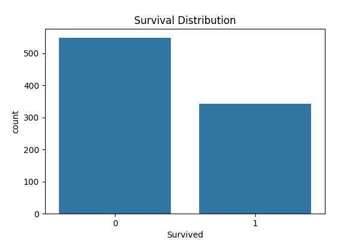
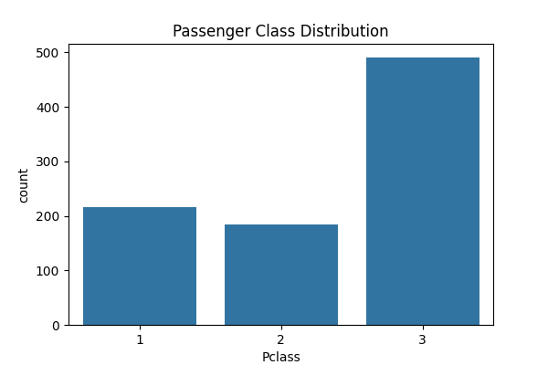
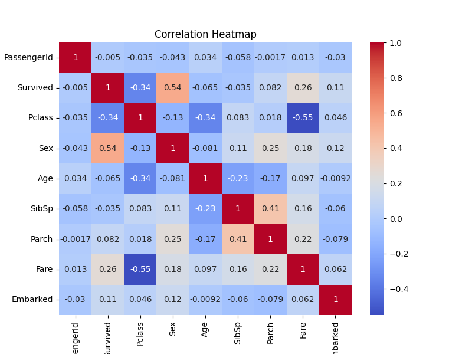

# Exploratory Data Analysis (EDA) Project

## Overview

This project performs Exploratory Data Analysis (EDA) on the Titanic dataset to uncover patterns, trends, and relationships between passenger characteristics and survival outcomes.

The analysis uses statistical summaries and visualizations to gain insights into the dataset and identify important factors that may influence survival.

---

## Technologies Used

- Python
- Pandas
- Matplotlib
- Seaborn

---

## Dataset

**Titanic Passenger Dataset**

The dataset contains information about passengers aboard the Titanic, including:

- Passenger Class (Pclass)
- Name
- Sex
- Age
- Number of Siblings/Spouses (SibSp)
- Number of Parents/Children (Parch)
- Fare
- Embarkation Port
- Survival Status

---

## Project Objectives

- Perform exploratory data analysis on the dataset
- Generate statistical summaries
- Visualize important distributions
- Identify correlations among variables
- Extract meaningful insights from the data

---

## Statistical Summary

The dataset contains:

- 891 passenger records
- 11 features
- No missing values after preprocessing

Key statistics such as mean, median, standard deviation, minimum, and maximum values were generated using Pandas.

---

## Visualizations

### 1. Survival Distribution

This visualization shows the number of passengers who survived and those who did not survive.

---

### 2. Age Distribution

This histogram illustrates the age distribution of passengers aboard the Titanic.

---

### 3. Passenger Class Distribution

This chart displays the distribution of passengers across different ticket classes.

---

### 4. Correlation Heatmap

The heatmap highlights relationships between numerical variables and helps identify factors associated with survival.

---

## Key Insights

- Most passengers did not survive the disaster.
- Passenger class significantly influenced survival chances.
- The majority of passengers were young and middle-aged adults.
- Fare and passenger class showed notable relationships.
- Several passenger attributes exhibited correlations with survival outcomes.

---

## Learning Outcomes

This project provided practical experience in:

- Data Exploration
- Data Cleaning Verification
- Statistical Analysis
- Data Visualization
- Correlation Analysis
- Insight Generation

---

## Conclusion

Exploratory Data Analysis helped uncover important patterns and trends within the Titanic dataset. The generated visualizations and statistical summaries provide a strong foundation for further predictive modeling and machine learning applications.

---

## Author

**Shagun**
